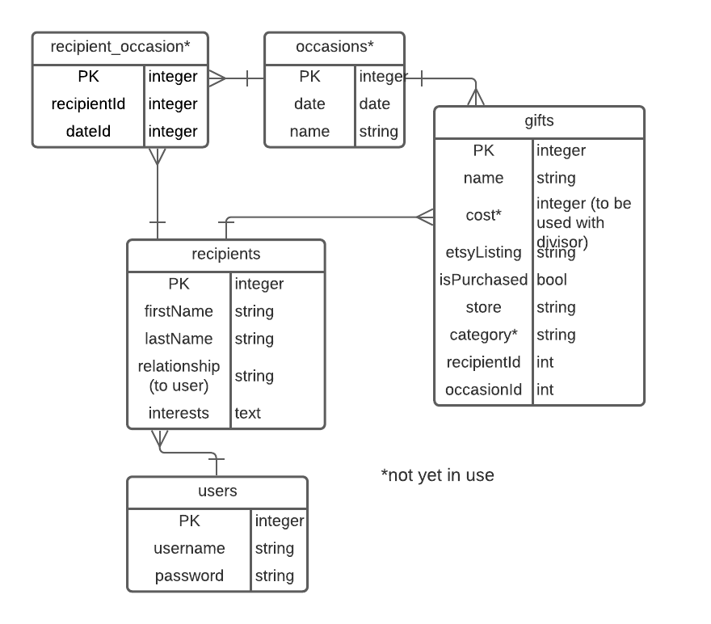

# Present-ly: A Holiday Shopping Planner

[Use Present-ly here!](https://present-ly-gift-planner.herokuapp.com/)

I'm not the best gift-giver, especially when I am shopping for more than one person. This application will allow users to track who they are shopping for, what their interests are, and any potential gift ideas before they are ready to make purchases.

## Stack
Present-ly is a full-stack REST API built using HTML5, CSS, JavaScript, Express, Postgres, Node, SQL, and Materialize CSS.

## User Stories
* As a shopper, I would like to have quick access to a list of those I would like to give gifts to, and a summary of their interests.
* I would like to create and save gift ideas for later comparison and reference.
* I would like to be able to access and save Etsy listings that are related to my recipients' interests.

## ERD

The recipient_occasion and occasions tables are not yet in use, but will be employed in a future version of the application.

## Routes
| VERB   | URL PATTERN         | ACTION (CRUD)    | DESCRIPTION                                 |
| ------ | ------------------- | ---------------- | ------------------------------------------- |
| GET    | /recipients         | Index (Read)     | displays index of all recipients (for user) |
| GET    | /recipients/new     | New (Read)       | show form                                   |
| DELETE | /recipients/:id     | Destroy (Delete) | deletes a recipient                         |
| GET    | recipients/edit/:id | Edit (Read)      | show form                                   |
| PUT    | /recipients/:id     | Update (Update)  | edit the recipient                          |
| GET    | /recipients/:id     | Show (Read)      | show individual                             |
| POST   | /recipients         | Create (Create)  | creates a new recipeint                     |
| GET    | /gifts              | Index (Read)     | displays gifts                              |
| GET    | /gifts/results      | Index (Read)     | displays etsy search results                |
| POST   | /gifts              | Create (Create)  | adds gift                                   |
| DELETE | /gifts/:id          | Destroy (Delete) | deletes a gift                              |
| PUT    | /gifts/:id          | Update (Update)  | updates gift (mark as purchased)            |
| GET    | /gifts/etsy/:etsyId | New (Read)       | displays form to add selected gift          |

## Future Updates
* Option to designate occasions for specific gifts. These will include pre-made events (holidays) and user-created events (specific birthdays, anniversaries, etc.)
* Automatic gift suggestions based on the interests provided for each recipient.
* Display how many gifts have been purchased on each recipient's card.

## Installations Instructions
To run Present-ly on your local device:
1. Fork and clone this repo.
1. Run `npm i` to install the required node modules for this project.
1. Create a `.env` file in your local repo.
1. In `.env`, set `SUPER_SECRET_SECRET` equal to your desired secret (any string).
1. Obtain an API eky from Etsy [here](https://www.etsy.com/developers/documentation/getting_started/api_basics). This key is only for GET routes, and the request should be approved automatically.
1. In `.env`, set `ETSY_API_KEY` equal to your new key.
1. Run `sequelize db:migrate` to create your SQL database.
1. Run `nodemon` (or NPM start) and head to localhost:3000. Create an account and get started!